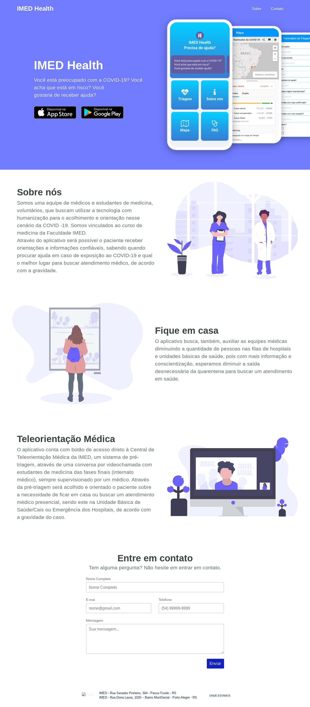

<h1 align="center">
	
</h1>

<h3 align="center">
  IMED Health
</h3>

  <a href="#-about-the-project">About the project</a>&nbsp;&nbsp;&nbsp;|&nbsp;&nbsp;&nbsp;
  <a href="#-preview">Preview</a>&nbsp;&nbsp;&nbsp;|&nbsp;&nbsp;&nbsp;
  <a href="#-license">License</a>

## 🚀 Preview

    <a href="https://health.imed.edu.br/" target="_blank">https://health.imed.edu.br</a>
    

## 👨🏻‍💻 About the project

Landing page to publicize the IMED Health application. Through the application it will be possible for the patient to receive reliable guidance and information, knowing when to seek help in case of exposure to COVID-19 and what is the best place to seek medical care, according to severity.

## 📝 License

This project is licensed under the MIT License - see the [LICENSE](LICENSE) file for details.

---

Made with 💙&nbsp;by Vitor Grenzel 👋&nbsp;[See my linkedin](https://www.linkedin.com/in/vitorgrenzel/)